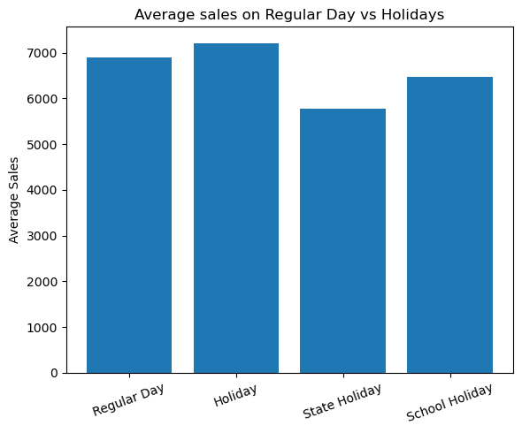
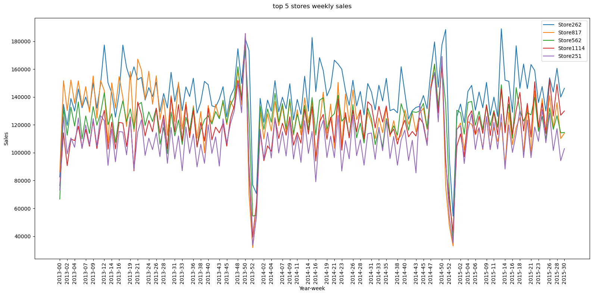
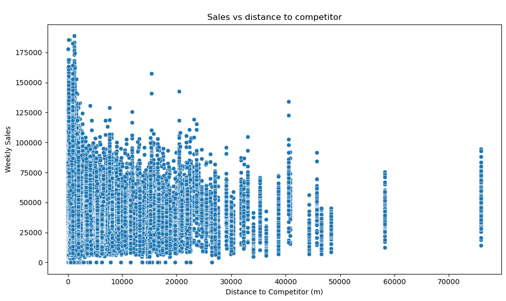
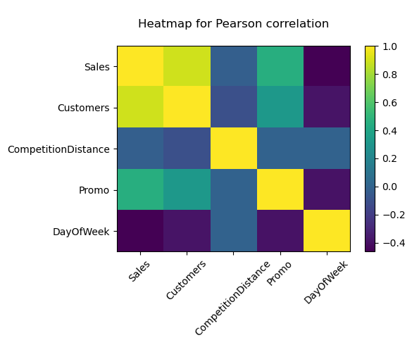

# Rossmann Store Sales Analysis

Exploratory analysis and sales prediction across 1,115 Rossmann drug stores, uncovering what drives daily sales and comparing two models for forecasting them.

## Problem & Motivation

Retail sales are shaped by a mix of predictable patterns (weekday, season) and situational ones (promotions, holidays, nearby competition). Using ~3 years of daily sales records across 1,115 stores, this project asks: what actually drives sales, and how well can a simple model forecast them?

## Data

- **Source:** [Rossmann Store Sales](https://www.kaggle.com/c/rossmann-store-sales) (Kaggle competition dataset)
- **Scope:** ~1 million daily sales records (Jan 2013 – Jul 2015) across 1,115 stores, merged with per-store metadata (store type, competition distance, promo participation)

## Key Findings

**Holidays and promotions both lift sales.** Average sales are higher on holidays than regular days, and stores running promotions see a clear sales boost.

**Top-performing stores are more consistent, not just higher-grossing.** The 5 highest-cumulative-sales stores show relatively stable week-to-week sales, while the 5 lowest-cumulative-sales stores swing between very high and very low weeks despite operating in a similar overall range.

**Closer competition is associated with *better* performance, not worse.** Counterintuitively, stores within 5,000 meters of a competitor tend to have the highest weekly sales, gradually decreasing at greater distances, likely because competitors cluster in high-traffic commercial areas.

**Customer count is the strongest correlate of sales** (Pearson r ≈ 0.89, Spearman ρ ≈ 0.90), but the relationship isn't uniform across store types: Store Type D has the fewest customers yet the highest sales per customer, while Store Type B has high customer volume but lower sales per customer.

**Seasonal and weekly patterns are strong.** Sales peak on weekends and around Christmas and Easter, with a clear monthly seasonal cycle across the full date range.

## Modeling

Two models were built to predict daily sales from operational features (customer count, promo status, holiday flags, day of week), trained on data through April 2015 and validated on May–July 2015 (a genuine time-based holdout, not a random split):

| Model | RMSE |
|---|---|
| Linear Regression | 1555.32 |
| Random Forest | 1486.31 |

The Random Forest's lower RMSE was confirmed with a paired t-test comparing the two models' predictions (t ≈ 2.99, p = 0.0028), showing the improvement is statistically significant rather than noise.

## Tech Stack

`Python` · `pandas` · `NumPy` · `scikit-learn` · `SciPy` · `matplotlib` · `seaborn`

## Future Improvements

- Add store-type and promo-interaction features to the prediction models rather than relying on operational features alone
- Try gradient boosting (XGBoost/LightGBM) as a stronger baseline than Random Forest
- Investigate the competition-distance finding further. It's counterintuitive enough to be worth deeper analysis rather than taking at face value

## Author

Russell Maidza
